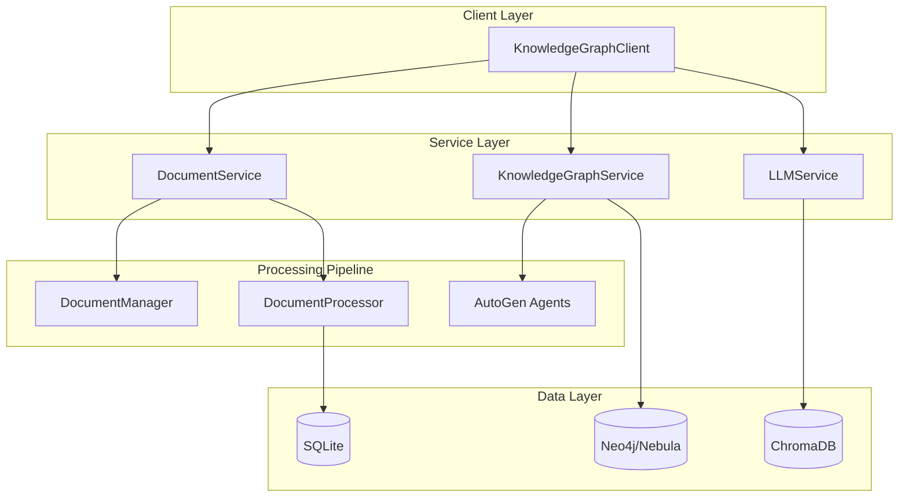

# AI Knowledge Agent

> An enterprise-grade Python framework for intelligent document processing and knowledge graph construction using multi-agent AI systems.

[](https://www.python.org/downloads/)
[](https://opensource.org/licenses/MIT)

## Overview

KnowledgeAgent is an AI-powered system that transforms unstructured documents into intelligent knowledge graphs. The system leverages multiple Large Language Models working in collaboration to extract, validate, and enrich semantic relationships from text, creating a comprehensive knowledge representation suitable for advanced AI applications.

## 🏗️ Architecture 

### Multi-Agent Knowledge Extraction
- **Collaborative AI Pipeline**: Three specialized AutoGen agents work together:
  - `graph_constructor`: Extracts subject-predicate-object triplets with inference capabilities
  - `graph_validator`: Validates relationships and identifies missing connections
  - `graph_enricher`: Refines and enhances the final knowledge graph

### Intelligent Document Processing
- **Adaptive Chunking**: Context-aware segmentation that preserves document structure
  - Structured Markdown chunker respects heading hierarchies
  - Recursive character splitter for non-structured content
  - Automatic strategy selection based on content analysis
- **Multi-format Support**: Extensible parser framework for various document types

### Scalable Data Architecture
- **Multi-database Integration**: 
  - SQLite for document metadata and caching
  - Neo4j/Nebula Graph for knowledge graph storage
  - ChromaDB for vector embeddings and semantic search
- **Service-Oriented Design**: Modular services with clear separation of concerns

## Key Features

- **Multi-Agent AI System**: Collaborative LLM agents for robust knowledge extraction
- **Smart Document Processing**: Hierarchical chunking that preserves semantic context
- **Knowledge Graph Construction**: Automated extraction of entities and relationships
- **Semantic Search**: Vector-based similarity search across document collections
- **High-Performance Architecture**: Asynchronous processing with connection pooling
- **Enterprise-Ready**: Comprehensive logging, error handling, and configuration management

## 🏛️ System Architecture



## 📋 Technical Requirements

- **Python**: 3.9+
- **LLM API**: OpenAI API key required
- **Optional**: Docker for graph database deployment

### Core Dependencies
- **AI/ML**: `langchain`, `langchain-openai`, `autogen`
- **Databases**: `neo4j-python`, `chromadb`, `sqlite3`
- **Processing**: `pydantic`, `nltk`, `unstructured`

## 🔧 Installation & Setup

### Quick Start
```bash
# Clone the repository
git clone https://github.com/yourusername/knowledgeAgent.git
cd knowledgeAgent

# Install in development mode
pip install -e .

# Set up environment variables (SECURE)
cp config.example .env
# Edit .env file with your actual API keys and configuration
```

### Production Deployment
```bash
# Install from PyPI (when published)
pip install knowledgeAgent

# Start graph database services
docker-compose up -d

# Verify installation
python -c "from knowledgeAgent.api.client import KnowledgeGraphClient; print('✅ Installation successful')"
```

## 💻 Usage Examples

### Basic Document Processing
```python
from knowledgeAgent.api.client import KnowledgeGraphClient

# Initialize the client
client = KnowledgeGraphClient(
    graph_db_config={
        "db_type": "neo4j",
        "host": "localhost",
        "port": 7687,
        "database": "knowledge",
        "username": "neo4j",
        "password": "password"
    },
    llm_config={
        "model": "gpt-3.5-turbo",
        "temperature": 0.2,
        "api_key": "your-openai-api-key"
    }
)

# Process a document
document_id = client.add_document(
    document_path="research_paper.md",
    document_type="markdown"
)

# Extract knowledge graph
client.extract_document_ontology(document_id)
```

### Multi-Agent Collaboration
The system implements a multi-agent architecture where specialized AI agents collaborate to ensure high-quality knowledge extraction:

```python
# Three agents work in sequence:
# 1. Constructor extracts initial triplets
# 2. Validator checks accuracy and finds missing relationships  
# 3. Enricher refines and enhances the final output

def extract_ontology(document: str) -> dict:
    """Multi-agent knowledge extraction with validation"""
    group_chat = GroupChat(
        agents=[graph_constructor, graph_validator, graph_enricher],
        max_round=3,
        speaker_selection_method="round_robin"
    )
    # ... implementation details
```

### Intelligent Chunking Strategy
Context-aware document segmentation that preserves semantic meaning:

```python
class StructuredMarkdownChunker:
    """Respects document hierarchy for optimal chunking"""
    
    def chunk_section(self, section: MarkdownSection, max_size: int):
        # Recursive chunking that maintains context
        # Preserves header hierarchies and relationships
        # Falls back to character-based splitting when needed
```

## 📄 License
MIT License - see [LICENSE.txt](LICENSE.txt) for details.


